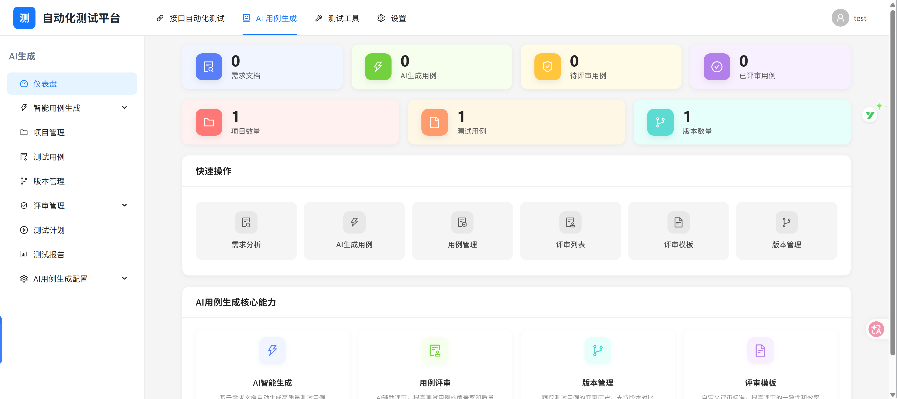
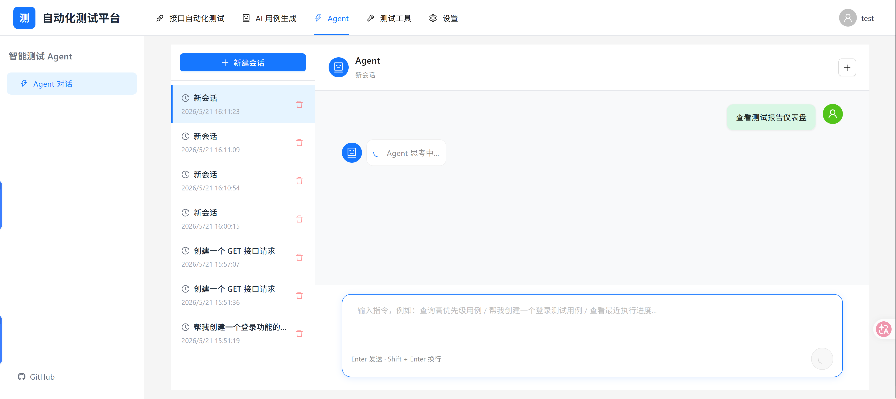
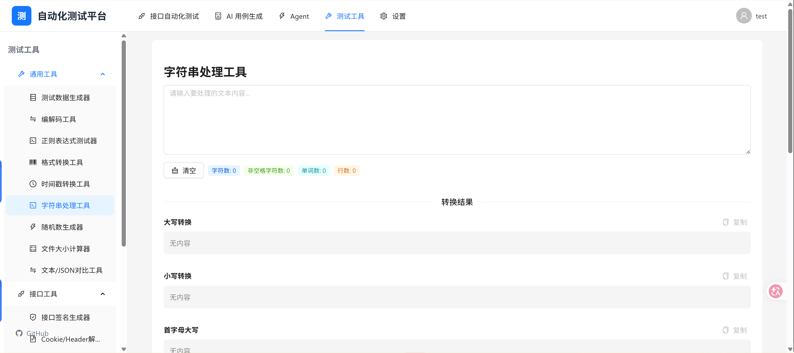

# QAgent 智能自动化测试平台

<div align="center">

**基于 AI 驱动的全栈测试管理平台**

[](https://github.com/lkjjgcgg/QAgent/actions/workflows/ci.yml)
[](https://www.python.org/)
[](https://www.djangoproject.com/)
[](https://reactjs.org/)
[](https://ant.design/)
[](LICENSE)

</div>

## 📖 项目简介

QAgent 是一个智能自动化测试平台，集成了 AI 需求分析、测试用例生成、API 自动化测试、测试用例管理、评审、执行和报告等完整功能。

<div align="center">
  
  
  
</div>

## ✨ 核心特性

### AI 智能化能力
- **AI 需求分析**: 自动解析需求文档（PDF/Word/TXT），智能提取业务需求
- **智能测试用例生成**: 基于需求自动生成测试用例，支持多种测试类型
- **多模型支持**: 兼容 OpenAI 接口协议，可接入 DeepSeek、通义千问、硅基流动等任意兼容服务，模型配置与切换在平台内完成

### 智能测试 Agent
- **ReAct 智能引擎**: 基于 ReAct 框架，支持 Thought → Action → Observation 循环推理
- **自然语言交互**: 通过对话方式执行测试任务，如查询用例、创建用例、查看报告等
- **工具调用能力**: 自动调用平台工具完成复杂任务，包括测试用例管理、接口测试、报告查询等
- **会话上下文记忆**: 支持多轮对话，自动维护会话历史和上下文理解
- **实时执行反馈**: 展示 Agent 思考过程、工具调用步骤和执行结果

### 安全机制
- **JWT 认证**: 采用企业级 JWT 双 Token 安全机制
- **自动刷新**: Access Token 过期前自动刷新，无感续期
- **Token 黑名单**: 登出时自动将 Token 加入黑名单，防止重放攻击
- **请求队列**: Token 刷新期间请求自动排队等待，确保请求不丢失

### 统一配置中心
- **AI 模型配置**: 统一管理多种 AI 模型的服务类型、模型名、密钥与接口地址
- **连接测试**: 支持 AI 模型连接测试和验证
- **通知配置**: 统一管理邮件 / Webhook 机器人通知

### 测试用例管理
- **完整的用例生命周期管理**: 创建、编辑、版本控制、归档
- **灵活的用例组织**: 支持项目、版本、标签等多维度分类
- **详细的用例步骤**: 支持步骤化用例设计，包含前置条件、操作步骤、预期结果
- **附件和评论**: 支持用例附件上传和团队协作评论

### 测试用例评审
- **评审流程管理**: 支持多人评审、评审模板、检查清单
- **评审状态跟踪**: 待评审、评审中、已通过、已拒绝等状态管理
- **评审意见记录**: 支持整体意见、用例意见、步骤意见等多层级反馈
- **评审模板**: 可自定义评审检查清单和默认评审人

### API 测试
- **项目和集合管理**: 支持 HTTP 协议，树形结构组织 API
- **请求管理**: 支持 GET/POST/PUT/DELETE/PATCH/HEAD/OPTIONS 等多种 HTTP 方法
- **环境变量**: 全局和局部环境变量管理，支持变量替换
- **测试套件**: 批量执行 API 请求，支持断言和执行顺序配置
- **请求历史**: 完整的请求执行历史记录和结果追踪
- **定时任务**: 支持定时执行测试套件，邮件/Webhook 通知
- **测试报告**: 自动生成 Allure 测试报告


### 测试执行与报告
- **测试计划**: 创建测试计划，关联项目、版本和测试用例
- **测试执行**: 手动和自动化测试执行，实时记录测试结果
- **执行历史**: 完整的执行历史追踪和结果对比
- **测试报告**: 多维度数据统计和可视化图表
- **Allure 集成**: 支持生成专业的 Allure 测试报告

### 项目与团队管理
- **项目管理**: 多项目支持，项目成员和角色管理
- **版本管理**: 版本规划和测试用例关联
- **权限控制**: 基于项目的成员角色权限管理
- **用户配置**: 个性化用户设置和偏好配置

## 技术架构

### 后端技术栈
- **框架**: Django 4.2 + Django REST Framework
- **数据库**: MySQL 8.0+ (PyMySQL)
- **API 文档**: drf-spectacular (Swagger/ReDoc)
- **安全认证**: JWT (rest_framework_simplejwt) + Token 黑名单
- **后台管理**: Django SimpleUI
- **AI 集成**: 通过 httpx 直连 OpenAI 兼容接口，不依赖各家官方 SDK；模型服务（DeepSeek / 通义千问 / 硅基流动等）在平台配置中心统一管理
- **HTTP 客户端**: httpx
- **定时任务**: 轮询式调度器（Django 管理命令 `run_all_scheduled_tasks`，需手动启动进程）
- **接口自动化测试**: pytest + Allure
- **文档解析**: PyPDF2, python-docx

### 前端技术栈
- **框架**: React 19.2 + React Router DOM 7.14
- **UI 组件**: Ant Design 6.3
- **设计系统**: 基于 `web/DESIGN.md` 的设计令牌层（`src/theme/tokens.js` 为唯一色值来源，经 `src/theme/antdTheme.js` 映射到 Ant Design 主题，`npm run check:theme` 可校验令牌生效性）
- **状态管理**: Redux Toolkit 2.11 + React Redux 9.2
- **构建工具**: Vite 8.0
- **HTTP 客户端**: Axios 1.15
- **国际化**: i18next 26.0
- **图表可视化**: ECharts 6.0
- **代码编辑器**: Monaco Editor 0.55
- **日期处理**: Day.js 1.11
- **工具库**: Lodash 4.18

## 🧪 自动化测试与 CI

项目包含三层测试：

- **后端单元测试**（各 app 的 `tests.py`，Django `TestCase`）——直接操作模型层，验证字段、默认值与约束，随用例事务回滚
- **后端接口测试**（`api_tests/`，pytest + requests + Allure）——黑盒打真实 HTTP 接口，覆盖注册、登录、用户流程与越权（IDOR）
- **前端单元测试**（`web/src/**/*.test.js`，Vitest + jsdom）——覆盖 axios 拦截器（自动注入令牌、401 刷新令牌并重放原请求）、Redux 登录态持久化与令牌过期判断、设计令牌工具函数

### CI 流水线（`.github/workflows/ci.yml`）

每次 push / PR 自动触发，包含两个作业：

| 作业 | 做什么 | 说明 |
|---|---|---|
| `static-checks` | `manage.py check` + `makemigrations --check` | 后者可拦截「改了模型忘了生成迁移文件」这类本地测试发现不了的问题 |
| `api-tests` | 起 MySQL 8 容器 → `migrate` → `manage.py test`（单元测试）→ 启动真实服务 → `pytest`（接口测试） | 接口测试是黑盒的，因此 CI 里跑的是**真实的端到端链路**；单元测试用独立测试库，与接口测试互不影响 |

> 前端单元测试（`web/`）目前在本地通过 `npm test` 运行，尚未接入 CI。

### 测试设计要点

- **两条收集链路各管一段**：`pytest.ini` 里 `testpaths = api_tests`，pytest 只收接口测试；各 app 的单元测试交给 Django 自带的 `manage.py test`。两者都必须在 CI 里显式执行——仓库里 `apps/requirement_analysis/tests.py` 的 4 个用例曾因缺少后者而长期未被执行（且实际上全部失败）却无人发现
- **数据自清理**：用例通过 fixture 登记自己造的账号，跑完自动删除，不污染数据库
- **无隐式依赖**：基准数据由 `conftest.py` 的 session 级 fixture 幂等创建，空数据库上也能跑通
- **地址可配置**：被测服务地址集中在 `api_tests/qa_config.py`，用 `QAGENT_BASE_URL` 环境变量覆盖
- **安全回归用例**：`test_security.py` 覆盖越权访问（IDOR），采用「实验组 + 对照组 + 取证 + 正向用例防误伤」的设计

### 本地运行

```bash
# 后端单元测试（不需要启动服务，会自动建/销毁测试库）
python manage.py test

# 后端接口测试：先启动服务（另开一个终端）
python manage.py runserver
pytest api_tests -v

# 可选：生成 Allure 报告
pytest api_tests --alluredir=allure-results
allure generate allure-results -o allure-report --clean

# 前端单元测试（在 web/ 目录下，不需要后端服务）
cd web
npm test            # 跑一次
npm run test:watch  # 监听文件变化，改完自动重跑
```

## 快速开始

### 环境要求

- **Python**: 推荐 Python 3.12，其他版本可能会存在兼容性问题
- **Node.js**: 18+ (开发环境必须安装 Node.js 用于构建前端项目，生产可不安装)
- **MySQL**: 8.0+ (必须安装 MySQL 客户端，用于执行数据库迁移等操作)
- **Java**: 17+ (可选，仅用于生成 Allure 测试报告，未安装则无法生成报告)

### 后端部署

1. **克隆项目**
```bash
git clone <repository-url>
cd QAgent
```

2. **创建虚拟环境**
```bash
python -m venv venv
# Windows
venv\Scripts\activate
# Linux/Mac
source venv/bin/activate
```

3. **安装依赖**
```bash
pip install -r requirements.txt
```

4. **配置环境变量**
```bash
# 复制示例配置文件到 .env 文件
# 按照.env文件模板配置你的数据库连接信息等
cp .env.example .env
```

5. **初始化数据库**
```bash
# 创建数据库
mysql -u root -p
CREATE DATABASE QAgent CHARACTER SET utf8mb4 COLLATE utf8mb4_unicode_ci;
EXIT;

# 执行迁移
python manage.py makemigrations
python manage.py migrate

# 创建超级用户
python manage.py createsuperuser
```

6. **启动服务**
```bash
# 启动 Django 开发服务器
python manage.py runserver
```

### 前端部署

1. **安装依赖**
```bash
cd web
npm install
```

2. **启动开发服务器**
```bash
npm run dev
```

3. **构建生产版本**
```bash
npm run build
```

### 访问应用

- **前端**: http://localhost:5173
- **后端 API**: http://localhost:8000
- **API 文档**: http://localhost:8000/api/docs/
- **Admin 后台**: http://localhost:8000/admin/


## 📝 许可证

本项目采用 MIT 许可证 - 详见 [LICENSE](LICENSE) 文件


